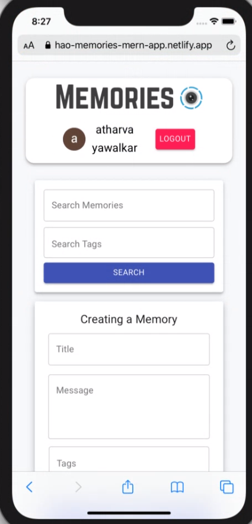
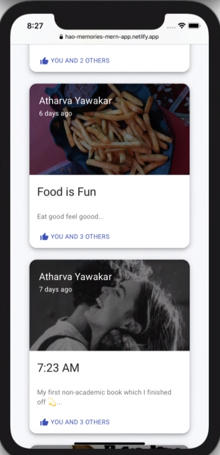
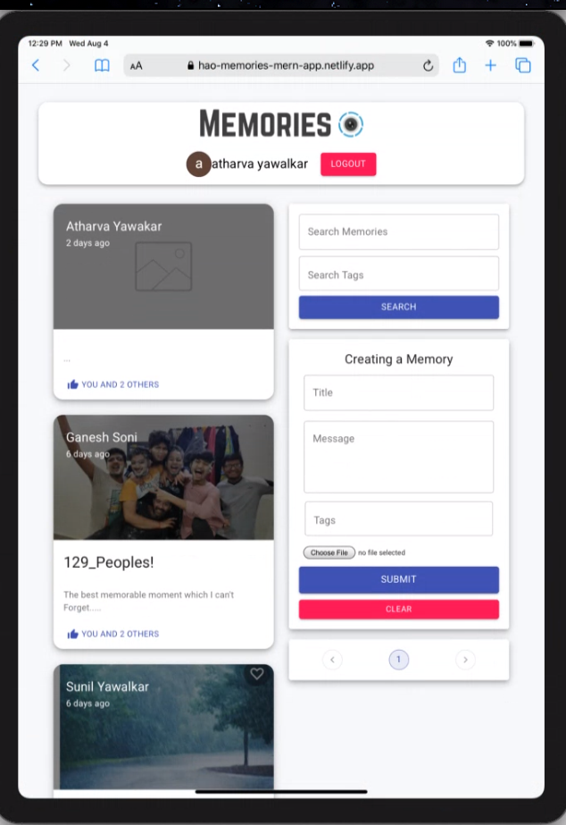
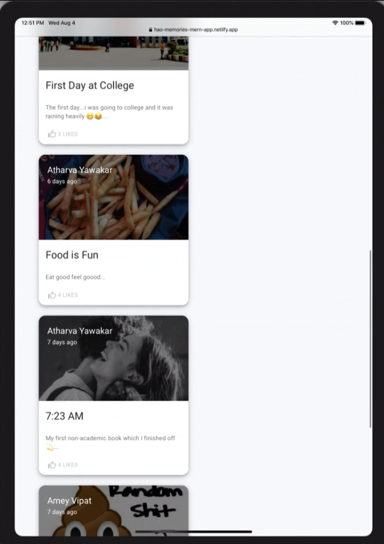

<h1 align="center">  &nbsp; Memories App  </h1>

  

<h1></h1>

> Built with MERN stack (MongoDB, Express, React, and Node).
> Memories App, where you can post interesting events that happened in your lives


### <h2 align="center">  💫💫💫  &nbsp; [Live Demo](https://hao-memories-mern-app.netlify.app/) 💫💫💫  </h2>


## 📜 &nbsp; Table of contents

- [Introduction](#--introduction)
- [Main Features](#--main-features)
- [Setup](#--setup)
- [Demo](#--demo)
- [Technologies](#--technologies)
- [Key Concepts](#--key-concepts)
- [Author](#--author)


<h1></h1>

## ⭐ &nbsp; Introduction

 Full Stack MERN Application - from start to finish. 

 The App is called "Memories" and it is a simple social media app that allows users to post interesting events that happened in their lives.
 with real app features like user authentication and social login using Google accounts.


<h1></h1>


## 🚩 &nbsp; Main Features


> This App was made to post user's interesting events that happing in their day to day life

>Users can post their event and like other users posts and comment on them


#### Project methodology

- **Login and Logout system**
  - Every user has to log in with google accounts to post the memories.
  - Once the user is logged in, the user will able to use all the features of the app.
  - If the user has not logged in, the user will only be able to view/see  posts from the other users.
  - That is if the user has not logged in, user will not able to access all the potential features of the app.
  
- **Product life cycle**
  - A user will log in into the app with their Google accounts
  - A user will post their memories through the form "Creating a Memory".
  - After posting the memories. memories will appear on the memories section of the app.
  - From the memories section of the app, all users of the app  will be able to see all the posts posted.  
  - Any user can like and comment on the posts that are posted on the app.
  

- **Other facilities**
  - Users can edit their previous posts by click on the post.
  - Users can add tags to their post.
  - Users can search memories by memories title or tags.
  - Users can delete their respective posts.

<h1> </h1>

## 💻 &nbsp; Setup

- To run this project,  locally on your system
- Fork this repo and run the `git clone <forked repo>` command from your terminal/bash
- Create a `.env` file in the following  directory and store the following:
  - On client directory 
    - REACT_APP_GOOGLE_CLIENT_ID=Insert the valid google client id
  - On server directory   
    - CONNECTION_URL=Insert the correct connection URL for your MongoDB database
  
```
$ cd  server 
$ npm install (install backend dependencies)
$ cd client
$ npm install (install frontend dependencies)
$ cd ..
$ cd sever
$ npm start (for Node server side development)
$ cd ..
$ cd client 
$ npm start (for React client side development)
```

- Backend server will be running on http://localhost:5000
- Frontend server will be running on http://localhost:3000

> For CONNECTION_URL for the backend server, you have to   visit [mongodb atlas](https://www.mongodb.com/cloud/atlas). Here you can create your own collection and can use connect app URL for CONNECTION_URL

> For Google client Id you have to visit [Google developers console](https://console.cloud.google.com/apis/dashboard?pli=1) from here generate your respective client Id 

<h1></h1>


## 👨‍💻 &nbsp; Demo

<p align="center">
<p>Screenshoots of some main features</p>

<p align="center">
  
&nbsp; &nbsp; &nbsp; &nbsp;
  
</p>
 <br/>
 <p align="center">
   
&nbsp; &nbsp; &nbsp; &nbsp;
  
</p>
</p>
  

<h1></h1>

## 💡 &nbsp; Key Concepts

- CRUD operations
- Authentication system
- Storing user data
- OOP (Object Oriented Programming)

## 💹 &nbsp; Technologies

> Project is created with:

#### Backend

- Node Js : A asynchronous event-driven JavaScript runtime, Node.js is designed to build scalable network  applications. 
- Express : Express is a minimal and flexible Node.js web application framework that provides a robust set of features for web applications.
- Mongoose : Mongoose is an Object Data Modeling (ODM) library for MongoDB and Node Js.
- MongoDB: MongoDB is a source-available cross-platform document-oriented database program. Classified as a NoSQL database program.
- JSON Web Tokens or JWTs : A JSON Web Token is used to send information that can be verified and trusted by means of a digital signature.

#### Frontend

- React JS:React JS  is a free and open-source front-end JavaScript library for building user interfaces or UI components.
- Redux :Redux is an open-source JavaScript library for managing application state.  
- React-Router : React Router is a  library for routing in React. It enables the navigation among views of various components in a React Application.
- Axios : Promise based HTTP client for the browser and node.js.
- Material UI : Material-UI is simply a library that allows us to import and use different components to create a user interface in our React Js.

#### Alternatives to technology used
- React Js can be replaced by others popular fronted framework like Vue,Angular,Svelte or Ember
- Node Js can be  replaced by Deno/koa , flask/Django
- Mongodb can be replaced by SQL type DB
- Material UI can be replaced  by BootStrap

# Author

👤 &nbsp; **Atharva Yawalkar**

- My website : [My website](https://atharva137.github.io/Atharva_Yawalkar/myPortfolio/)
- Github :     [@atharva137](https://github.com/atharva137)
- Linkedin :   [Atharva-yawalkar](https://www.linkedin.com/in/atharva-yawalkar-2416b41b2/)
- Email :      [atharvayawalkar1377@gmail.com](mailto:atharvayawalkar1377@gmail.com)
